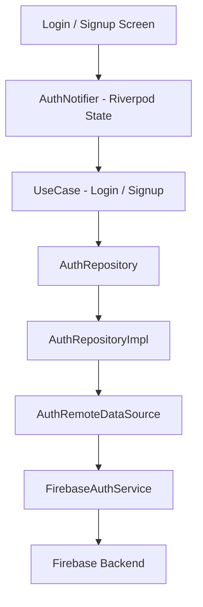
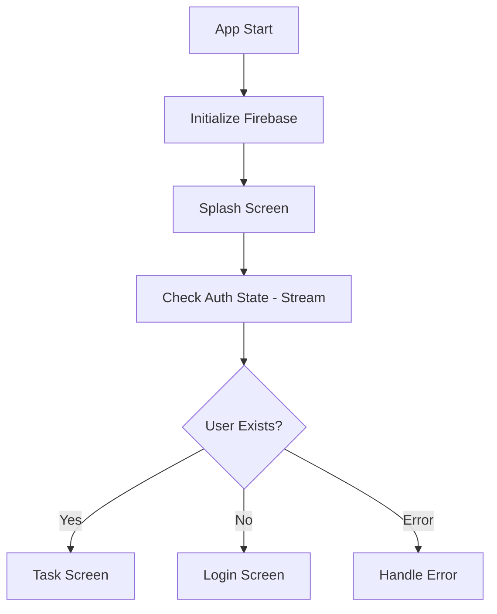

# **TaskGi – Task Management Application**


---

## **Overview**

TaskGi is a scalable Flutter-based task management application built using a clean architectural approach. The application focuses on robust authentication, modular structure, and maintainable state management, serving as a strong foundation for extending into a full-featured task management system.

The current implementation primarily covers **authentication flow**, **state management**, and **application architecture**, with provisions for seamless integration of task management and advanced features.

---

## **Key Features Implemented**

* Firebase Authentication (Login / Signup / Logout)
* Clean Architecture (Layered Separation)
* State Management using Riverpod
* Scalable folder structure
* Error handling and mapping
* Reactive authentication state handling
* UI with reusable components
* Splash-based session persistence handling

---

## **Tech Stack & Dependencies**

### **Core Technologies**

* Flutter (UI Framework)
* Dart (Programming Language)

### **Backend & Services**

* Firebase Authentication

### **State Management**

* flutter_riverpod

### **Other Libraries**

* flutter_svg (for vector assets)
* firebase_core

---

## **Project Structure**

```bash
lib/
│
├── core/
│   ├── services/
│   │   └── firebase_auth_service.dart
│   │
│   ├── utils/
│   └── theme/
│
├── features/
│
│   ├── auth/
│   │   ├── data/
│   │   │   ├── datasources/
│   │   │   ├── models/
│   │   │   └── repositories/
│   │   │
│   │   ├── domain/
│   │   │   ├── entities/
│   │   │   ├── repositories/
│   │   │   └── usecases/
│   │   │
│   │   └── presentation/
│   │       ├── providers/
│   │       └── screens/
│   │
│   └── tasks/ (planned / partially implemented)
│
├── shared/
│   └── widgets/
│
└── main.dart
```

---

## **Architecture**

The application is built using **Clean Architecture principles**, ensuring:

* Separation of concerns
* Testability
* Scalability
* Replaceable data sources

### **Layered Breakdown**

#### **1. Presentation Layer**

* Handles UI and state
* Uses Riverpod for state management
* Reacts to user input and updates UI

#### **2. Domain Layer**

* Contains business logic
* Includes:

    * Entities
    * Repository contracts
    * Use cases

#### **3. Data Layer**

* Handles external interactions
* Implements repositories
* Converts raw data into domain models

#### **4. Core Layer**

* Shared services (e.g., Firebase service)
* Utilities and global configurations

---

## **Authentication System Architecture**

### **Flow (Layered Execution)**



### **Explanation**

* UI triggers authentication actions
* StateNotifier manages loading, success, and error states
* UseCases encapsulate business logic
* Repository abstracts data source
* RemoteDataSource interacts with Firebase
* Firebase service executes actual API calls

---

## **System Flow (High-Level)**



The application listens to authentication state changes and dynamically routes the user.

The stream-based approach ensures **real-time session handling**.


---

## **App Flow (User Journey)**

### **1. Splash Screen**

* Displays branding
* Checks authentication state
* Navigates accordingly


### **2. Authentication Flow**

* Login Screen
* Signup Screen
* Input validation
* Error feedback handling


### **3. State Handling**

* Loading state during API calls
* Error state display
* Successful login navigation


### **4. Navigation**

* Authenticated → Task List Screen
* Unauthenticated → Login Screen

---

## **State Management Design**

Implemented using **Riverpod StateNotifier**:

* Centralized state (AuthState)
* Immutable updates using copyWith
* Clear separation of UI and logic
* Dependency injection using providers

Key characteristics:

* Predictable state transitions
* Scalable for additional features (tasks, filters, etc.)
* Test-friendly design

---

## **Error Handling Strategy**

A structured error mapping approach is implemented at the service layer:

* Firebase exceptions are mapped to user-friendly messages
* Prevents UI exposure to raw backend errors


---

## **Data Modeling**

### **Entity**

* Represents core business object (UserEntity)


### **Model**

* Extends entity
* Handles serialization/deserialization
* Converts Firebase User → Domain Model


---

## **Dependency Injection**

Implemented using Riverpod providers:

* Service → DataSource → Repository → UseCase → UI

This ensures:

* Loose coupling
* Easy mocking for testing
* Clear dependency graph

---

## **UI & Component Design**

Reusable components:

* CustomButton
* CustomTextField

Characteristics:

* Consistent styling
* Reusability across screens
* Encapsulated behavior

---

## **Screenshots**

Screenshots of the application UI have been added to visually demonstrate:

* Splash Screen
* Login Screen
* Signup Screen
* Task Screen
* Add Task Screen
* Logout Screen

These provide a clear understanding of the user experience and design implementation.

---

---

## **Testing**

The project includes **unit and state-level tests** to ensure reliability and maintainability.

### **Test Coverage**

* FirebaseAuthService (service layer)
* AuthRemoteDataSource (data layer)
* AuthRepositoryImpl (repository layer)
* UseCases (business logic)
* AuthNotifier (state management)

### **Testing Approach**

* Mock-based testing using `mocktail`
* Isolation of layers (no real Firebase calls)
* Verification of:

  * Data transformation
  * Error handling
  * State transitions

### **Run Tests**

```bash
flutter test
```

---

## **Test Structure**

```bash
test/
│
├── core/
│   └── services/
│
├── features/
│   └── auth/
│       ├── data/
│       ├── domain/
│       └── presentation/
```

---

## **Platform Note**

* The application has been developed and tested primarily for **Android**.
* iOS support is not verified due to the absence of a macOS/iOS testing environment.

---


## **Future Enhancements**

The current system is designed to be extensible. The following improvements can be implemented:

### **1. Task Management (Core Feature Expansion)**

* Create / Update / Delete tasks
* Firestore integration
* Task categorization and filtering

### **2. UI/UX Improvements**

* Add micro-interactions and animations
* Improve transitions between screens
* Introduce skeleton loaders

### **3. Advanced Features**

* Push notifications (task reminders)
* Offline support with caching
* Dark mode support
* User profile management

### **4. Performance Optimization**

* Pagination for task lists
* Optimized rebuilds using Riverpod selectors

### **5. Security Enhancements**

* Input sanitization
* Secure storage for tokens
* Role-based access (future scaling)

---

## **How to Extend This Project**

If additional time is available, the application can be upgraded by:

* Integrating Firestore for persistent task storage
* Adding animated transitions (Hero animations, implicit animations)
* Implementing a full task dashboard with filters and calendar view
* Introducing modular feature expansion (notifications, analytics)

---

## **Conclusion**

TaskGi is structured as a **scalable, production-ready foundation** for a modern task management application. The use of Clean Architecture combined with Riverpod ensures that the system is maintainable, testable, and extensible.

The current implementation successfully establishes:

* A robust authentication system
* A well-defined architectural pattern
* A scalable codebase ready for feature expansion

